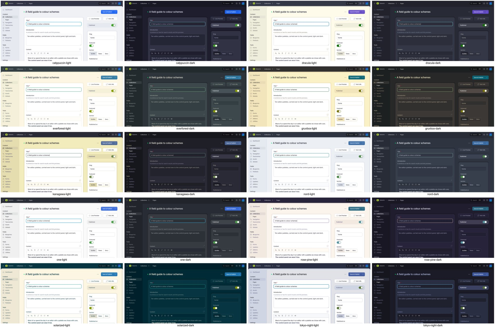
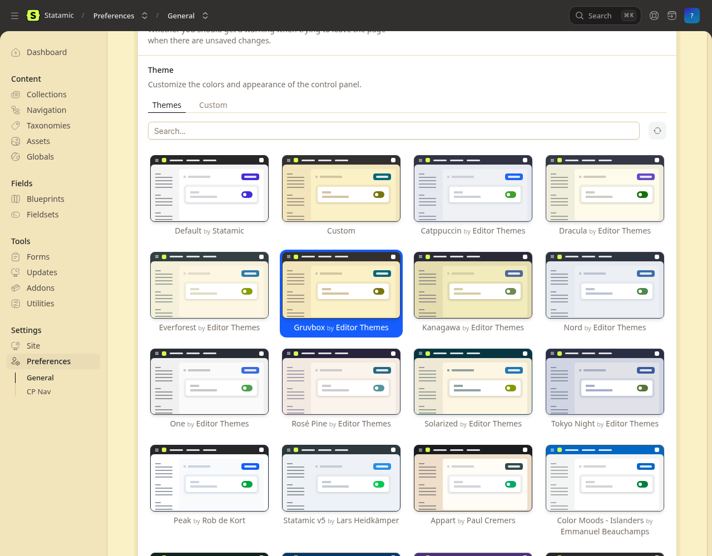

# Editor Themes for Statamic

Ten popular editor colour schemes for the Statamic 6 control panel, each in a light and a dark version: Catppuccin, Dracula, Everforest, Gruvbox, Kanagawa, Nord, One, Rosé Pine, Solarized and Tokyo Night. They show up in Statamic's own theme picker, so you choose one the same way you would choose any other theme. Works on Statamic Core and Pro.



| Theme | Light mode | Dark mode |
| --- | --- | --- |
| Catppuccin | Latte | Mocha |
| Dracula | Alucard | Dracula |
| Everforest | Light, medium | Dark, medium |
| Gruvbox | Light | Dark |
| Kanagawa | Lotus | Wave |
| Nord | Snow Storm, as in Doom Emacs's Nord Light | Polar Night |
| One | One Light | One Dark |
| Rosé Pine | Dawn | Rosé Pine |
| Solarized | Light | Dark |
| Tokyo Night | Day | Night |

## Install

```bash
composer require jotham-lec/statamic-editor-themes
```

Requires PHP 8.3 and Statamic 6.30 or later. There are no assets to publish and no configuration.

## Use

Open **Preferences → Themes**. The ten themes are listed first, marked "by Editor Themes", ahead of the themes from the Statamic Marketplace. Pick one and save. Like any Statamic theme, it is stored in your user preferences, so it follows you to every browser and device. Statamic switches between the light and dark versions when your colour mode changes.

On Statamic Pro, a super admin can also save a theme as the default for everyone, or for a role, with the picker's **Save as** menu.

To set a theme from the command line, for instance while provisioning a site:

```bash
php please editor-themes:apply                           # asks which theme; the site's only user
php please editor-themes:apply tokyo-night jo@example.com
php please editor-themes:remove jo@example.com           # back to Statamic's default
```

The theme ids are `catppuccin`, `dracula`, `everforest`, `gruvbox`, `kanagawa`, `nord`, `one`, `rose-pine`, `solarized` and `tokyo-night`.



## How the colours are chosen

Each theme lives in its own class in `src/Themes`, and every colour is the original palette's own hex value, labelled with its name in that palette.

- **Greys.** Statamic shades its interface with a 14-step grey ramp, 50 to 950. Each version of a theme puts its palette's background, surface, comment and foreground colours at the steps where they belong. The steps in between are mixed in OKLab.
- **Accents.** Each theme uses its palette's blue for links and buttons, green for success and switches, red for danger, yellow for the progress bar and cyan for focus. Where a palette has no colour of that kind, it uses the nearest one: Dracula's purple, or Rosé Pine's pine and foam.
- **Contrast.** Some palettes have accents that are too light for this use, Solarized's and Everforest's light ones for example. Those accents are darkened (or, in dark mode, lightened) only as far as needed. In both modes text reaches 4.5:1 and switches, status colours and the focus ring reach 3:1 (WCAG AA). The tests check every theme against these ratios.

The addon adds its themes to the picker by extending the call that fetches Marketplace themes. It changes no core files and stores nothing beyond the theme preference Statamic already keeps. Choosing one of these themes sends nothing to statamic.com: Statamic only reports Marketplace themes, which have numeric ids.

## Develop

```bash
composer install
vendor/bin/pest
vendor/bin/pint
```

To add a theme, copy a class in `src/Themes`, fill in the palette, and list it in `src/Themes.php`. The tests then check its contrast in both modes.

Release: `git tag -a vX.Y.Z -m vX.Y.Z && git push --tags`.

## Support

Report bugs and request themes at [GitHub Issues](https://github.com/Jotham-LEC/statamic-editor-themes/issues). Support is community support, on a best-effort basis.

## Credits

The palettes belong to their authors. This addon adapts them to Statamic's theme format:

- [Catppuccin](https://github.com/catppuccin/catppuccin), MIT
- [Dracula and Alucard](https://draculatheme.com), MIT
- [Everforest](https://github.com/sainnhe/everforest) by sainnhe, MIT
- [Gruvbox](https://github.com/morhetz/gruvbox) by Pavel Pertsev, MIT/X11
- [Kanagawa](https://github.com/rebelot/kanagawa.nvim) by rebelot, MIT
- [Nord](https://www.nordtheme.com) by Sven Greb, MIT
- [One](https://github.com/atom/one-dark-syntax), from Atom, MIT
- [Rosé Pine](https://rosepinetheme.com), MIT
- [Solarized](https://ethanschoonover.com/solarized) by Ethan Schoonover, MIT
- [Tokyo Night](https://github.com/folke/tokyonight.nvim) by Folke Lemaitre, Apache-2.0

Some greys are taken from [Doom Emacs's themes](https://github.com/doomemacs/themes) (MIT), which also set the list of themes. Full notices are in [NOTICE.md](NOTICE.md).

## Licence

MIT. See [LICENSE.md](LICENSE.md).
